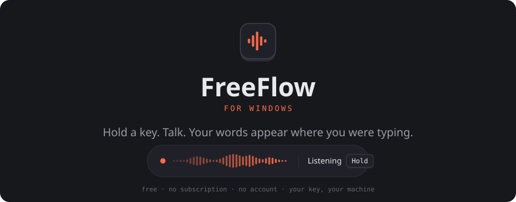

<p align="center">
  <picture>
    <source media="(prefers-color-scheme: dark)" srcset=".github/assets/hero-dark.svg">
    <source media="(prefers-color-scheme: light)" srcset=".github/assets/hero-light.svg">
    
  </picture>
</p>

<p align="center">
  <a href="../../releases/latest"><b>Download for Windows</b></a>
  &nbsp;·&nbsp;
  <a href="windows/INSTALL.md">Three-minute setup</a>
  &nbsp;·&nbsp;
  <a href="#how-it-got-here">How it got here</a>
</p>

<br>

## You already talk faster than you type

Everyone does, by roughly three times. The gap between the two is why dictation
keeps almost catching on and then not quite: the tools have always been a little
worse than just typing. You dictate into one app, then copy it somewhere else.
You say "period" out loud like it's 1998. It writes down every "um."

FreeFlow closes the gap. You hold a key, say the thing, let go, and the words
are simply *there* — in the email, the chat box, the terminal, wherever your
cursor already was. Cleaned up. Punctuated. The ums removed.

It takes about a second.

```
                      what you say                            what you get
  ┌──────────────────────────────────────┐   ┌──────────────────────────────┐
  │ "um so hey can you send me the uh    │   │ Hey, can you send me the     │
  │  the deck from tuesday, no actually  │ → │ deck from Wednesday when     │
  │  wednesday, whenever you get a sec"  │   │ you get a second?            │
  └──────────────────────────────────────┘   └──────────────────────────────┘
```

Notice it caught the correction. You said Tuesday, then said Wednesday, and it
knew which one you meant. That is not a transcript. It is what you were trying
to say.

<br>

## What makes it different

**It types where you are already typing.** No separate window to dictate into,
no copying and pasting. Your cursor does not move, and your clipboard comes back
exactly as you left it.

**It knows what you are looking at.** Dictating an email? It reads the
recipients and spells their names right. In a terminal? It knows `--force` is a
flag, not the words "dash dash force."

**It fixes what you actually meant.** Filler gone, self-corrections resolved,
"comma" turned into a comma, accents restored, your tone left alone.

**Edit Mode.** Select some text, hold the key, say *"make this shorter"* or
*"turn this into bullets."* The selection is replaced with the result.

**Free, and not the kind of free that becomes fifteen dollars a month.** No
FreeFlow account, no FreeFlow server, no telemetry. You bring your own API key
from a provider you pick. Groq's free tier is fast enough for live dictation and
costs nothing.

**Your voice goes exactly one place.** From your microphone to the transcription
provider you configured, and nowhere else. The recording is deleted the moment
it comes back as text, and your key is encrypted to your Windows account. Would
rather send audio nowhere at all? Point it at a local model through Ollama or LM
Studio and nothing leaves the machine.

<br>

## Try it in three minutes

<table>
<tr>
<td width="34%" valign="top">

**1. Get a free key**

At [console.groq.com/keys](https://console.groq.com/keys). Sign in, click
**Create API Key**, copy it.

It starts with `gsk_` and is shown only once.

</td>
<td width="33%" valign="top">

**2. Download and run**

[`FreeFlow-win-x64.exe`](../../releases/latest) from the latest release.

Nothing to install. Paste your key into the setup window.

</td>
<td width="33%" valign="top">

**3. Hold and talk**

Click into any text box. Hold **Right&nbsp;Ctrl**, say something, let go.

That's the whole thing.

</td>
</tr>
</table>

Windows will warn that it does not recognise the app, because it is not signed
with a paid certificate. Click **More info → Run anyway**. The full source is
right here if you would rather build it yourself.

[Full setup guide, including what to do if it will not start →](windows/INSTALL.md)

<br>

## How it got here

[FreeFlow](https://github.com/zachlatta/freeflow) is Zach Latta's app, and it is
a lovely piece of work. It is also **Mac only**, and looked likely to stay that
way, because it is roughly 18,000 lines of Swift welded directly to Apple:
AppKit, SwiftUI, AVFoundation, CoreAudio, the Accessibility API,
ScreenCaptureKit, Carbon. About 78% of it cannot exist on Windows. SwiftUI has
no Windows implementation at all, so even the interface had to be rebuilt from
nothing.

So this is not a port in the copy-the-files sense. It is a rewrite in C# that
keeps the parts worth keeping.

What survived is the part that is genuinely hard to get right, carried across
faithfully rather than reinvented — along with its test suite, translated case
for case, so the behaviour is pinned rather than hoped for:

| | |
|---|---|
| **The cleanup prompts** | Copied word for word. Every rule about self-corrections, preserved instructions, email formatting, and developer syntax is the original's. |
| **Hold, tap, and latch** | Including the trick where adding a modifier mid-hold latches recording on, so you can let go and keep talking. |
| **The hallucination filter** | Whisper says "thank you for watching" into silence. Suppressed, but only when the model's own metadata agrees nothing was said. |
| **The instruction guard** | Say "write an email to Alex" and you get those words, not an actual email. Harder than it sounds. |

Everything touching the operating system was rebuilt: a low-level keyboard hook
on its own message-pumping thread in place of the macOS event tap, WASAPI
capture instead of AVFoundation, the Win32 clipboard and synthetic keystrokes
instead of NSPasteboard, UI Automation instead of the Accessibility API, DPAPI
instead of the Keychain, and WPF instead of SwiftUI.

### The one thing that could not be saved

The Mac version's signature move is holding **Fn**. That is impossible here, and
not for want of trying: on virtually every Windows keyboard, `Fn` is handled
inside the keyboard's own firmware and never produces a scan code the operating
system can see. No application can detect it. Ever.

Right Ctrl takes its place, with Right Alt, Caps Lock, and F5 one click away in
Settings.

<br>

## Under the hood, if you care

The core is deliberately platform-free. Shortcut semantics, prompts, transcript
sanitising, rate-limit handling, and provider calls all target plain `net8.0`
with no Windows dependency, which is what makes them testable without a keyboard
or a microphone attached. Only the layer that touches Windows knows Windows
exists.

There is also a diagnostic log recording what each pipeline stage did — stage
names, timings, byte counts, error types, and deliberately none of your words.
That log is how most of the bugs in this thing got found.

[The full engineering write-up is here →](windows/README.md)

<br>

## The honest small print

- **It is not code-signed.** SmartScreen will warn on first launch. A
  certificate costs real money for a tool built for a couple of friends.
- **VPNs break it**, because Groq blocks VPN exit addresses. Add an exception or
  disconnect while dictating. [Details](windows/INSTALL.md).
- **Edit Mode cannot read every app.** Windows exposes selected text through UI
  Automation, which most native apps, Office, and browsers support, but some
  terminals and Electron apps do not.
- **Updates are not automatic.** It tells you when there is a new version and
  opens the page.

<br>

---

<p align="center">
  <sub>
    Windows version built on <a href="https://github.com/zachlatta/freeflow">FreeFlow</a> by
    <a href="https://github.com/zachlatta">Zach Latta</a>, maintained by
    <a href="https://github.com/marcbodea">@marcbodea</a>.<br>
    MIT licensed, same as the original. The macOS sources are still here,
    untouched, under <code>Sources/</code> — see
    <a href="https://github.com/zachlatta/freeflow">the original repository</a>
    for the Mac app.
  </sub>
</p>
